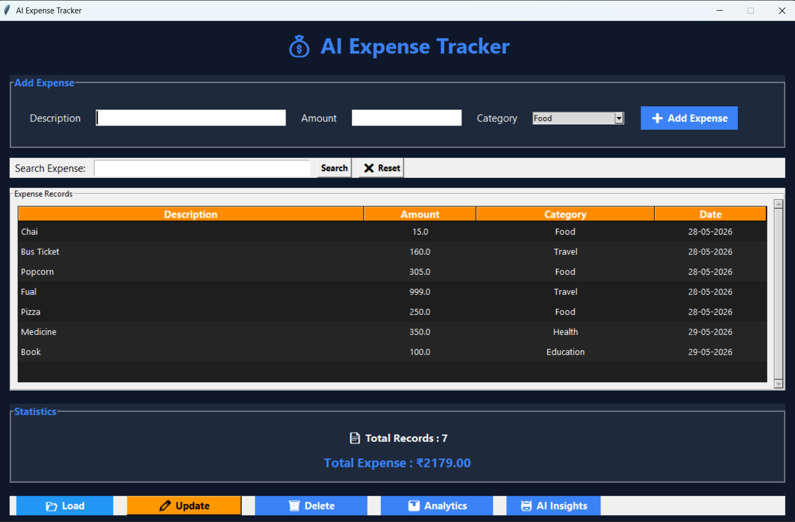
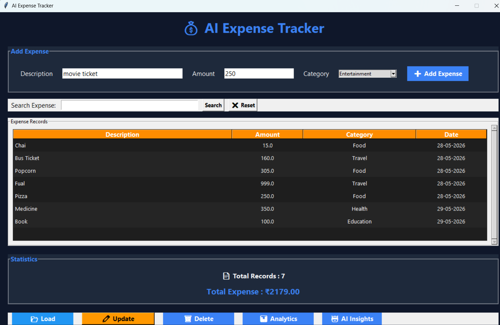
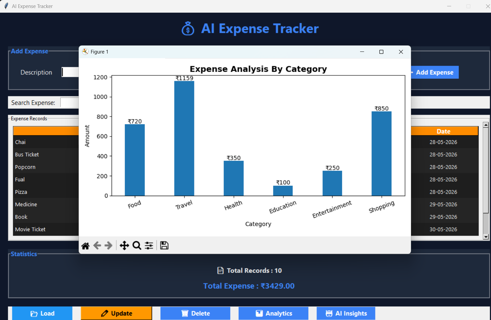
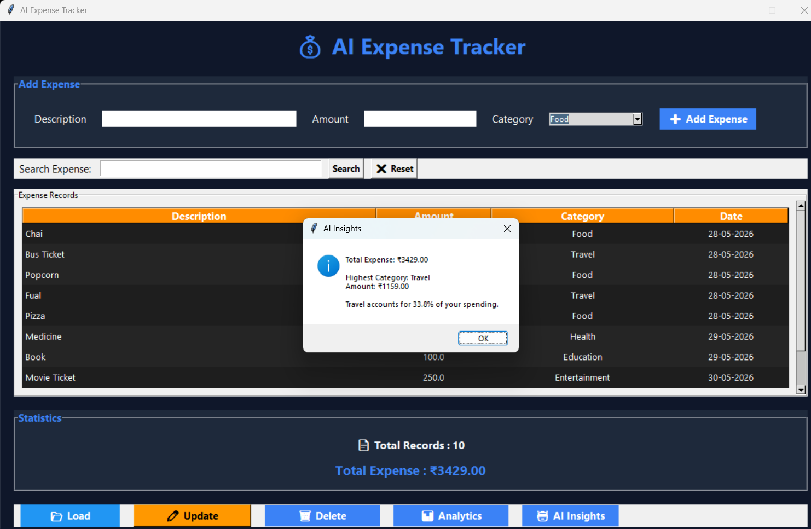

# 🤖 AI Expense Tracker

An intelligent desktop-based Expense Tracker built with Python and Tkinter that helps users manage daily expenses, analyze spending patterns, and automatically predict expense categories using Machine Learning.

---

## 📌 Project Overview

AI Expense Tracker is a smart personal finance management application that allows users to:

- Add, update, delete, and search expenses
- Automatically categorize expenses using AI/ML
- Visualize spending using graphs
- Export expense data to CSV
- View spending insights and statistics

The project combines GUI development, data handling, analytics, and machine learning in a single application.

---

## 🚀 Features

### Expense Management
- Add new expenses
- Update existing expenses
- Delete expenses
- Load selected expense data
- Automatic data saving

### Smart Search
- Search by description
- Search by category
- Instant filtering of records
- Reset search option

### AI-Powered Features
- Automatic expense category prediction
- Machine Learning model integration
- Smart expense classification

### Analytics
- Total expense calculation
- Total records counter
- Expense distribution by category
- Bar chart visualization
- Spending insights

### Data Handling
- JSON-based storage
- CSV export support
- Automatic data loading on startup

### User Experience
- Modern Tkinter UI
- Premium dashboard theme
- Hover effects on buttons
- Success and error notifications
- Confirmation dialogs

---

## 🛠 Technologies Used

- Python
- Tkinter
- JSON
- Pandas
- Matplotlib
- Scikit-Learn
- Joblib

---

## 📸 Screenshots

### Main Dashboard

### AI Category Prediction

### Expense Analytics

 

### AI Insights

## 🧠 Machine Learning Implementation

The application uses a trained Machine Learning model to predict the category of an expense based on its description.

### Example

Input:

Pizza

Predicted Category:

Food

The model is trained on expense descriptions and their corresponding categories.

---

## 📊 Project Structure

AI Expense Tracker/
│
├── gui.py
├── train_model.py
├── expenses.json
├── training_data.csv
├── expense_model.pkl
├── vectorizer.pkl
├── exported_expenses.csv
└── README.md

---

## ⚙️ Installation

### Clone Repository

git clone https://github.com/yourusername/AI-Expense-Tracker.git

### Navigate to Project

cd AI-Expense-Tracker

### Install Dependencies

pip install pandas matplotlib scikit-learn joblib

### Run Application

python gui.py

---

## 📈 Future Improvements

- Expense forecasting
- Monthly reports
- PDF export
- Dark/Light mode switch
- Database integration
- Cloud synchronization

---

## 🎯 Learning Outcomes

This project helped in learning:

- Python GUI Development
- Tkinter Widgets & Layouts
- Data Storage using JSON
- Data Visualization
- Machine Learning Integration
- Event Handling
- File Operations
- User Experience Design

---

## 👨‍💻 Author

Savan Karangiya

B.Voc IT (2026)

Interested in:
- Cloud Computing
- Machine Learning
- Software Development
- Data Analytics

---

## ⭐ Project Highlights

✔ Complete CRUD Operations

✔ Machine Learning Category Prediction

✔ Expense Analytics Dashboard

✔ CSV Export Functionality

✔ Search & Filtering

✔ Interactive Graphs

✔ Modern User Interface

✔ Portfolio Ready Project